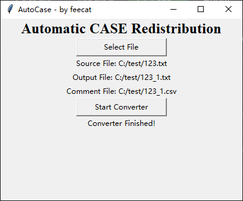
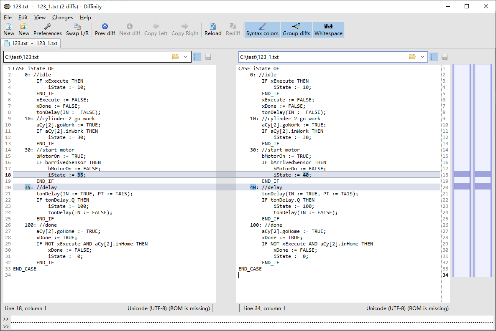
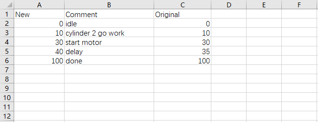

# AutoCASE
A Tool that can Re-Order number in CASE and output commit csv file.  
It will detect inserted step like 35, re-order it to 40(10xStep). it will not change large step. And output commit from step:, Then you can use it in hmi textlist.  

It will userful in some large CASE segments.

